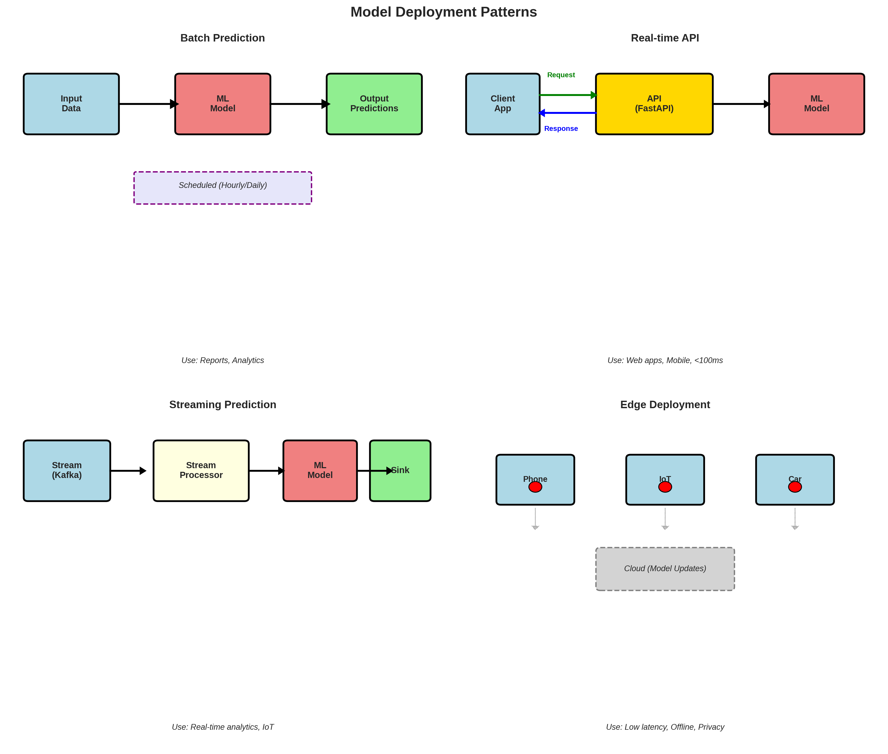

# Lesson 1: Model Deployment 🚀

**Module 10: Production ML & MLOps | Lesson 1 of 4**

Deploy ML models to production - from notebook to API!

---


## Visual Guides 📊


*Common deployment patterns: batch, real-time, streaming, edge*

---

## Deployment Options 🎯

1. **REST API** (Flask, FastAPI)
2. **Batch predictions**
3. **Embedded** (edge devices)
4. **Cloud services** (AWS, GCP, Azure)

---

## 1. Save/Load Models 💾

```python
import joblib
import pickle
from sklearn.ensemble import RandomForestClassifier

# Train model
model = RandomForestClassifier()
model.fit(X_train, y_train)

# Method 1: joblib (recommended)
joblib.dump(model, 'model.joblib')
loaded_model = joblib.load('model.joblib')

# Method 2: pickle
with open('model.pkl', 'wb') as f:
    pickle.dump(model, f)

with open('model.pkl', 'rb') as f:
    loaded_model = pickle.load(f)

# PyTorch
import torch

# Save
torch.save(model.state_dict(), 'model.pth')

# Load
model = MyModel()
model.load_state_dict(torch.load('model.pth'))
model.eval()
```

---

## 2. Flask API 🌐

```python
from flask import Flask, request, jsonify
import joblib
import numpy as np

app = Flask(__name__)

# Load model at startup
model = joblib.load('model.joblib')

@app.route('/predict', methods=['POST'])
def predict():
    """Predict endpoint"""
    try:
        # Get data from request
        data = request.get_json()
        features = np.array(data['features']).reshape(1, -1)

        # Predict
        prediction = model.predict(features)[0]
        probability = model.predict_proba(features)[0].tolist()

        # Return result
        return jsonify({
            'prediction': int(prediction),
            'probability': probability,
            'status': 'success'
        })

    except Exception as e:
        return jsonify({
            'error': str(e),
            'status': 'error'
        }), 400

@app.route('/health', methods=['GET'])
def health():
    """Health check endpoint"""
    return jsonify({'status': 'healthy'})

if __name__ == '__main__':
    app.run(host='0.0.0.0', port=5000)
```

**Test:**
```python
import requests

# Make prediction
data = {
    'features': [5.1, 3.5, 1.4, 0.2]
}

response = requests.post('http://localhost:5000/predict', json=data)
print(response.json())
```

---

## 3. FastAPI (Modern, Faster) ⚡

```python
from fastapi import FastAPI, HTTPException
from pydantic import BaseModel
import joblib
import numpy as np

app = FastAPI(title="ML Model API")

# Load model
model = joblib.load('model.joblib')

# Request schema
class PredictionRequest(BaseModel):
    features: list

class PredictionResponse(BaseModel):
    prediction: int
    probability: list
    status: str

@app.post('/predict', response_model=PredictionResponse)
async def predict(request: PredictionRequest):
    """Make prediction"""
    try:
        features = np.array(request.features).reshape(1, -1)

        prediction = int(model.predict(features)[0])
        probability = model.predict_proba(features)[0].tolist()

        return PredictionResponse(
            prediction=prediction,
            probability=probability,
            status='success'
        )

    except Exception as e:
        raise HTTPException(status_code=400, detail=str(e))

@app.get('/health')
async def health():
    return {'status': 'healthy'}

# Run: uvicorn app:app --reload
```

---

## 4. Docker Containerization 🐳

```dockerfile
# Dockerfile
FROM python:3.9-slim

WORKDIR /app

# Copy requirements
COPY requirements.txt .
RUN pip install --no-cache-dir -r requirements.txt

# Copy app
COPY . .

# Expose port
EXPOSE 5000

# Run
CMD ["python", "app.py"]
```

```bash
# Build
docker build -t ml-api .

# Run
docker run -p 5000:5000 ml-api

# Test
curl -X POST http://localhost:5000/predict \
  -H "Content-Type: application/json" \
  -d '{"features": [5.1, 3.5, 1.4, 0.2]}'
```

---

## 5. Batch Predictions 📦

```python
def batch_predict(model, input_file, output_file, batch_size=1000):
    """Process large files in batches"""
    import pandas as pd

    # Read data
    df = pd.read_csv(input_file)

    # Predict in batches
    predictions = []

    for i in range(0, len(df), batch_size):
        batch = df.iloc[i:i+batch_size]
        batch_pred = model.predict(batch)
        predictions.extend(batch_pred)

    # Save
    df['prediction'] = predictions
    df.to_csv(output_file, index=False)

    print(f"Processed {len(df)} rows")

# Usage
batch_predict(model, 'input.csv', 'output.csv')
```

---

## 6. Cloud Deployment ☁️

### AWS SageMaker

```python
import sagemaker
from sagemaker.sklearn import SKLearnModel

# Deploy to SageMaker
sklearn_model = SKLearnModel(
    model_data='s3://bucket/model.tar.gz',
    role='arn:aws:iam::123456789:role/SageMakerRole',
    entry_point='inference.py',
    framework_version='0.23-1'
)

predictor = sklearn_model.deploy(
    instance_type='ml.m5.large',
    initial_instance_count=1
)

# Predict
result = predictor.predict(data)
```

### Google Cloud AI Platform

```bash
# Upload model
gsutil cp model.joblib gs://bucket/model/

# Deploy
gcloud ai-platform models create my_model

gcloud ai-platform versions create v1 \
  --model my_model \
  --runtime-version 2.8 \
  --python-version 3.7 \
  --framework scikit-learn \
  --origin gs://bucket/model/
```

---

## Quick Reference 📖

**Deployment Checklist:**
```
✅ Save model (joblib/pickle)
✅ Create API (Flask/FastAPI)
✅ Add error handling
✅ Health check endpoint
✅ Input validation
✅ Logging
✅ Docker containerization
✅ Testing
✅ Documentation
```

**Production Considerations:**
- **Latency:** <100ms for real-time
- **Throughput:** Requests per second
- **Scalability:** Load balancing
- **Monitoring:** Logs, metrics
- **Versioning:** Model versions

---

## Key Takeaways 💡

1. **FastAPI** > Flask (modern, faster)
2. **Joblib** for saving scikit-learn models
3. **Docker** for containerization
4. **Health checks** essential
5. **Error handling** critical
6. **Test before** deploying!
7. **Monitor** in production

---

**Next:** [Lesson 2 - MLOps Basics →](Lesson%202%20-%20MLOps%20Basics.md)
