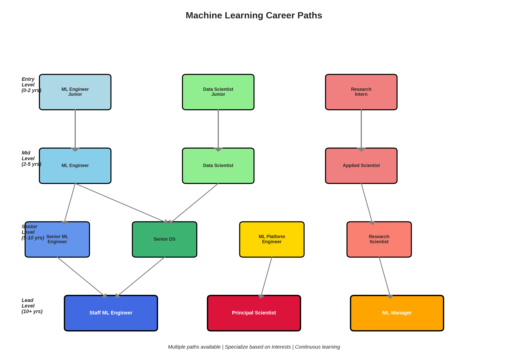
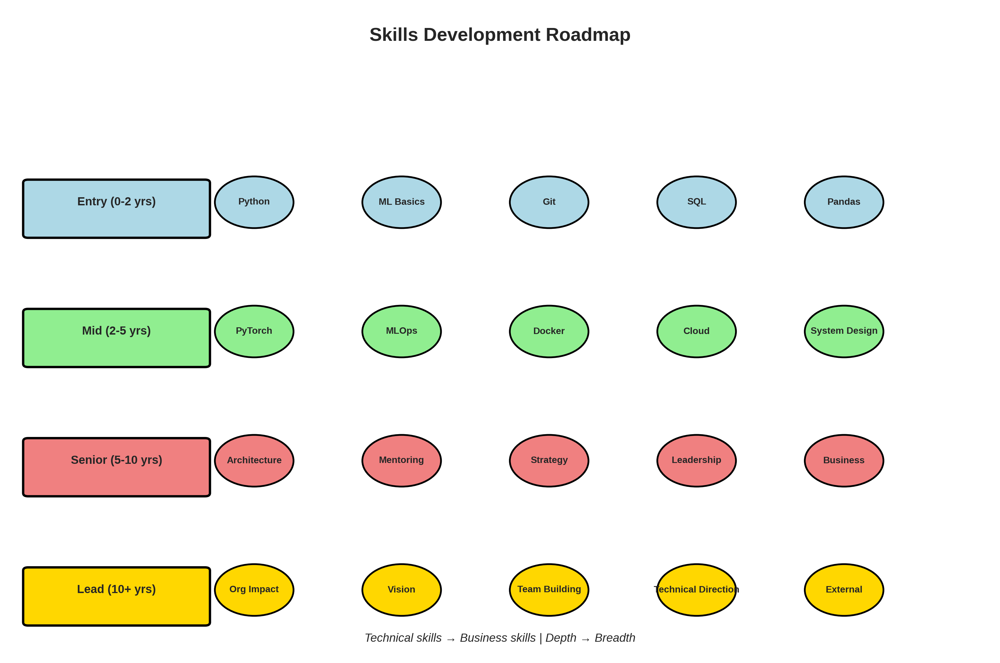
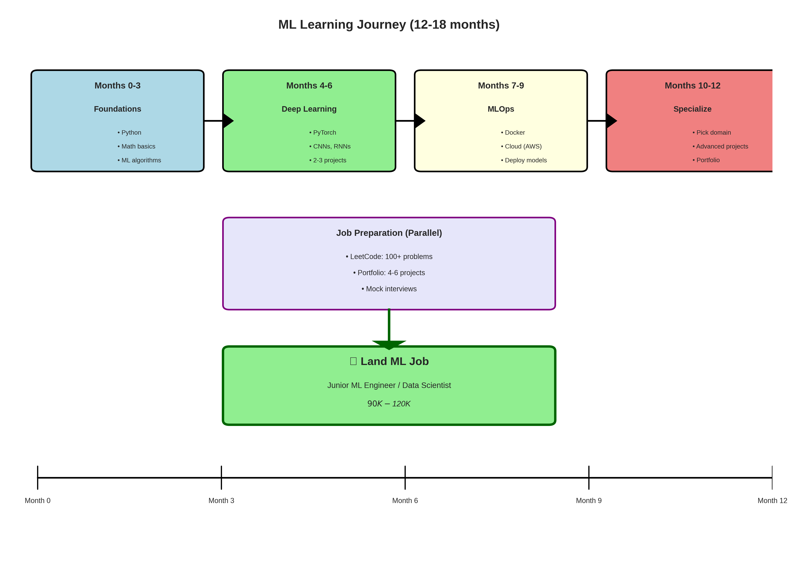
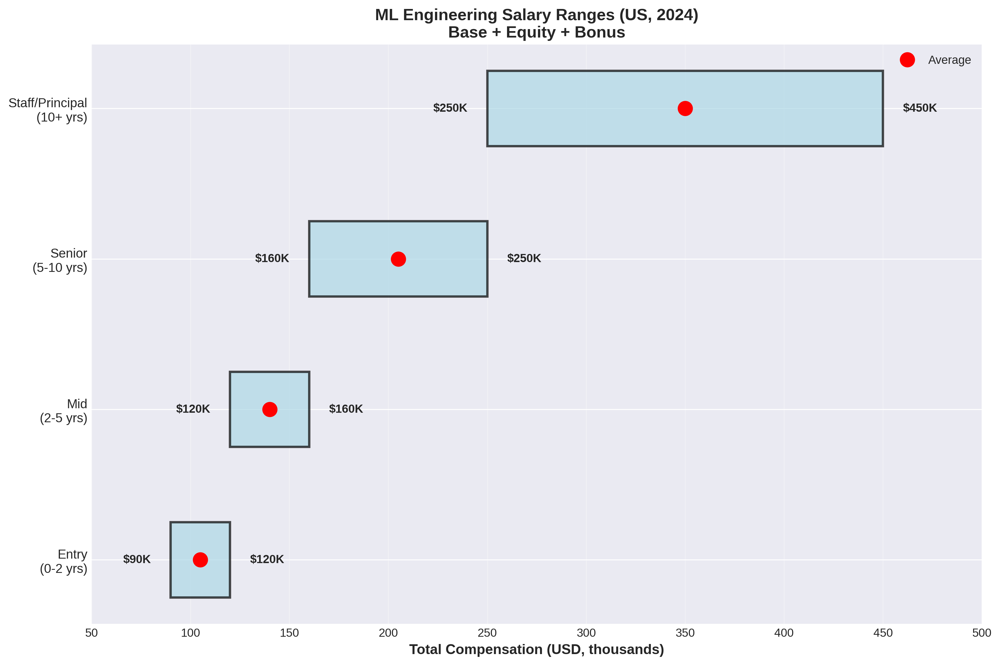

# Lesson 4: Career Paths in ML 🚀

**Module 11: Capstone & Career | Lesson 4 of 4**

Navigate your ML career from entry-level to senior roles!

---

## ML Career Landscape 🗺️

```
Entry Level (0-2 years)
    ↓
Mid Level (2-5 years)
    ↓
Senior Level (5-10 years)
    ↓
Principal/Staff/Lead (10+ years)
```

---

## Common ML Roles 💼




**Figure:** ML career progression paths from entry to lead level

### 1. Machine Learning Engineer

**What they do:**
- Build and deploy ML models to production
- Create data pipelines
- Optimize model performance
- Maintain ML infrastructure

**Skills:**
```
Core:
• Python, scikit-learn, PyTorch/TensorFlow
• ML algorithms (supervised, unsupervised)
• Feature engineering, model evaluation

Production:
• Docker, Kubernetes
• FastAPI, Flask
• Cloud (AWS, GCP, Azure)
• MLOps (MLflow, Airflow)

Software Engineering:
• Git, CI/CD
• Testing, debugging
• System design
```

**Typical Day:**
```
9:00  - Review model performance metrics
10:00 - Debug production issue (data drift)
11:00 - Retrain model with new data
12:00 - Lunch
13:00 - Code review for teammate's PR
14:00 - Design new feature pipeline
15:00 - Meeting: Discuss model deployment
16:00 - Implement A/B test
17:00 - Document changes, update wiki
```

**Salary (US):**
- Entry: $90K - $120K
- Mid: $120K - $160K
- Senior: $160K - $250K+

---

### 2. Data Scientist

**What they do:**
- Analyze data to answer business questions
- Build predictive models
- Conduct experiments (A/B tests)
- Present insights to stakeholders

**Skills:**
```
Core:
• Statistics, hypothesis testing
• Python, R, SQL
• ML modeling (scikit-learn, XGBoost)

Analytics:
• Data visualization (Matplotlib, Tableau)
• Business acumen
• Storytelling with data

Tools:
• Jupyter notebooks
• Pandas, NumPy
• SQL databases
```

**Typical Day:**
```
9:00  - Analyze user engagement data
10:00 - Build churn prediction model
11:00 - A/B test analysis
12:00 - Lunch
13:00 - Meeting: Present findings to product team
14:00 - Feature importance analysis
15:00 - Create dashboard (Tableau)
16:00 - Document methodology
17:00 - Plan next week's experiments
```

**Salary (US):**
- Entry: $80K - $110K
- Mid: $110K - $150K
- Senior: $150K - $220K

---

### 3. Research Scientist (ML)

**What they do:**
- Develop novel ML algorithms
- Publish papers at top conferences
- Explore cutting-edge techniques
- Prototype new models

**Skills:**
```
Core:
• Deep learning (PyTorch, JAX)
• Mathematics (linear algebra, optimization)
• Research methodology

Advanced:
• Read & implement papers
• Experiment design
• Novel architecture design

Publications:
• NeurIPS, ICML, ICLR, CVPR
```

**Typical Day:**
```
9:00  - Literature review (recent papers)
10:00 - Implement new architecture idea
11:00 - Run experiments on GPU cluster
12:00 - Lunch
13:00 - Analyze experiment results
14:00 - Discuss findings with team
15:00 - Write paper draft
16:00 - Debug training instability
17:00 - Plan next experiments
```

**Salary (US):**
- Entry (PhD): $130K - $180K
- Mid: $180K - $250K
- Senior: $250K - $400K+

**Requirements:**
Usually requires PhD or strong publication record.

---

### 4. ML Platform Engineer

**What they do:**
- Build ML infrastructure
- Create tools for ML engineers
- Manage model serving systems
- Optimize training pipelines

**Skills:**
```
Core:
• System design, distributed systems
• Kubernetes, Docker
• Cloud infrastructure (AWS, GCP)

ML:
• Understanding of ML workflows
• Model serving (TensorFlow Serving, TorchServe)
• Feature stores (Feast)

DevOps:
• CI/CD pipelines
• Monitoring (Prometheus, Grafana)
• Infrastructure as Code (Terraform)
```

**Typical Day:**
```
9:00  - Optimize model serving latency
10:00 - Debug Kubernetes deployment
11:00 - Design feature store architecture
12:00 - Lunch
13:00 - Meeting: ML infrastructure roadmap
14:00 - Implement auto-scaling for inference
15:00 - Code review
16:00 - Update documentation
17:00 - On-call rotation
```

**Salary (US):**
- Entry: $110K - $140K
- Mid: $140K - $180K
- Senior: $180K - $280K

---

### 5. Applied Scientist (Amazon, etc.)

**What they do:**
- Hybrid: Research + Engineering
- Solve business problems with ML
- Implement state-of-the-art models
- Bridge research and production

**Skills:**
```
Research:
• Read & implement papers
• Experiment design
• Novel solutions to business problems

Engineering:
• Production code
• Scalability
• Model deployment

Business:
• Understand metrics
• Communicate with stakeholders
```

**Salary (US):**
- Entry: $120K - $160K
- Mid: $160K - $220K
- Senior: $220K - $350K

---

## Specializations 🎯

### Computer Vision Engineer
```
Focus: Images, videos
Skills: CNNs, object detection, segmentation
Tools: OpenCV, PyTorch, YOLO
Industries: Autonomous vehicles, healthcare, retail
```

### NLP Engineer
```
Focus: Text, language
Skills: Transformers, BERT, GPT
Tools: HuggingFace, spaCy
Industries: Search, chatbots, content moderation
```

### Recommender Systems Engineer
```
Focus: Personalization
Skills: Collaborative filtering, ranking
Tools: PyTorch, TensorFlow Recommenders
Industries: E-commerce, streaming, social media
```

### Time Series ML Engineer
```
Focus: Forecasting, anomaly detection
Skills: ARIMA, LSTM, Prophet
Tools: statsmodels, Prophet, PyTorch
Industries: Finance, supply chain, IoT
```

---

## Company Types 🏢

### 1. Big Tech (FAANG+)
```
Examples: Google, Meta, Amazon, Apple, Microsoft, Netflix

Pros:
• High compensation ($200K - $500K+)
• Cutting-edge problems
• Large-scale systems (billions of users)
• Great learning opportunities
• Strong resume signal

Cons:
• Very competitive interviews
• Bureaucracy
• May work on narrow problem
• Long hours at some companies

Interview:
• 5-6 rounds
• LeetCode hard
• ML system design
• Research (for scientist roles)
```

### 2. Unicorn Startups
```
Examples: Stripe, Databricks, OpenAI, Scale AI

Pros:
• Equity upside potential
• Fast-paced, high impact
• Ownership of projects
• Modern tech stack
• Faster promotions

Cons:
• Higher risk
• Long hours
• Less structure
• Benefits may be less comprehensive

Interview:
• 4-5 rounds
• Take-home project common
• Culture fit important
```

### 3. Early-Stage Startups
```
Examples: Seed to Series B companies

Pros:
• Huge equity potential
• Wear many hats (learn fast)
• Direct impact on company
• Shape ML culture

Cons:
• High risk (most fail)
• Lower base salary
• Potentially poor work-life balance
• Limited resources

Best for:
• Risk-tolerant
• Want broad experience
• Entrepreneurial mindset
```

### 4. Enterprise Companies
```
Examples: Banks, Healthcare, Retail

Pros:
• Stable, good work-life balance
• Solve real-world problems
• Good benefits
• Lower interview bar

Cons:
• Lower compensation
• Legacy systems
• Slower pace
• Less cutting-edge

Best for:
• Stability-focused
• Domain-specific interest
• Work-life balance priority
```

---

## Career Progression 📈

### Entry Level → Mid Level (0-2 years)

**Goals:**
```
✅ Master core ML algorithms
✅ Ship 3-5 models to production
✅ Learn MLOps (Docker, CI/CD)
✅ Improve communication skills
✅ Build strong fundamentals
```

**How to accelerate:**
- Take ownership of projects
- Learn adjacent skills (engineering, product)
- Seek feedback actively
- Document your work
- Build cross-team relationships

---

### Mid Level → Senior (2-5 years)

**Goals:**
```
✅ Lead projects end-to-end
✅ Mentor junior engineers
✅ System design proficiency
✅ Business impact focus
✅ Technical decision-making
```

**How to accelerate:**
- Volunteer for high-impact projects
- Develop domain expertise
- Improve communication (write docs, give talks)
- Start mentoring
- Understand business metrics

---

### Senior → Staff/Principal (5-10 years)

**Goals:**
```
✅ Technical leadership
✅ Influence org-wide decisions
✅ Design complex systems
✅ Grow other engineers
✅ External visibility (blogs, talks, open source)
```

**How to accelerate:**
- Think strategically (3-year roadmaps)
- Build influence across teams
- Publish externally (blogs, papers)
- Contribute to open source
- Speak at conferences

---

## Transitioning to ML 🔄

### From Software Engineering

**Advantages:**
- Strong coding skills
- System design knowledge
- Production experience

**Learn:**
```
1. ML fundamentals (this course!)
2. Statistics, linear algebra
3. scikit-learn, PyTorch
4. Complete 3-4 ML projects
5. Kaggle competitions
```

**Timeline:** 6-12 months

---

### From Data Analytics

**Advantages:**
- SQL, data manipulation
- Business acumen
- Visualization skills

**Learn:**
```
1. Programming (Python OOP)
2. ML algorithms
3. Software engineering (Git, testing)
4. Model deployment
5. Cloud platforms
```

**Timeline:** 6-12 months

---

### From Academia (PhD)

**Advantages:**
- Deep theoretical knowledge
- Research skills
- Advanced mathematics

**Learn:**
```
1. Production ML (MLOps)
2. Software engineering best practices
3. Cloud platforms
4. Business context
5. Agile/scrum
```

**Timeline:** 3-6 months

**Roles to target:** Research Scientist, Applied Scientist

---

### From Other Fields

**Timeline:** 12-18 months

**Path:**
```
1. Foundations (3 months)
   • Python programming
   • Math (linear algebra, calculus, statistics)

2. ML Basics (4 months)
   • Complete this course
   • Kaggle competitions
   • Build 2-3 projects

3. Specialization (3 months)
   • Pick domain (CV, NLP, etc.)
   • Deep dive into specialty
   • Build 2 advanced projects

4. Job Prep (2 months)
   • LeetCode (100+ problems)
   • Mock interviews
   • Portfolio polish
```

---

## Skills Development Roadmap 🛤️




**Figure:** Skills development from technical to leadership

### Year 1: Foundations
```
✅ Master Python
✅ ML algorithms (sklearn)
✅ SQL, pandas
✅ Git, Linux basics
✅ 3-4 portfolio projects
✅ First ML job
```

### Year 2-3: Depth
```
✅ Deep learning (PyTorch)
✅ MLOps (Docker, APIs)
✅ Cloud (AWS/GCP)
✅ System design
✅ Lead projects
✅ Promotion to mid-level
```

### Year 4-5: Breadth + Leadership
```
✅ Multiple domains (CV, NLP, etc.)
✅ ML architecture design
✅ Mentoring
✅ Technical writing
✅ Conference talks
✅ Senior engineer
```

### Year 6+: Mastery + Impact
```
✅ Organization-wide impact
✅ Technical strategy
✅ Grow other engineers
✅ External visibility
✅ Staff/Principal
```

---

## Continuous Learning 📚




**Figure:** 12-18 month ML learning journey roadmap

### Must-Follow Resources

**Courses:**
- Fast.ai (Practical Deep Learning)
- Stanford CS229 (ML)
- Andrew Ng's Deep Learning Specialization

**Papers:**
- Arxiv.org (latest research)
- Papers With Code

**Blogs:**
- Distill.pub
- Google AI Blog
- OpenAI Blog

**Newsletters:**
- The Batch (Andrew Ng)
- Import AI
- TLDR AI

**Communities:**
- Kaggle
- Reddit: r/MachineLearning
- Twitter: Follow ML researchers

**Conferences:**
- NeurIPS, ICML, ICLR (research)
- MLOps World (production)
- PyData (applied)

---

## Networking & Community 🤝

**Online:**
```
✅ Twitter: Share learnings, engage with community
✅ LinkedIn: Connect with ML professionals
✅ GitHub: Contribute to open source
✅ Kaggle: Compete, learn from kernels
✅ Discord/Slack: ML communities
```

**Offline:**
```
✅ Meetups: Local ML groups
✅ Conferences: NeurIPS, CVPR, etc.
✅ Workshops: Hands-on learning
✅ University events: Guest lectures
```

---

## Work-Life Balance ⚖️

**Sustainable Career Tips:**

```
1. Set boundaries
   • No emails after 7pm
   • Weekend off (mostly)

2. Continuous learning (but paced)
   • 30 min/day side project
   • 1 paper/week
   • 1 course every 6 months

3. Health matters
   • Regular exercise
   • Sufficient sleep (7-8 hours)
   • Breaks during work

4. Avoid burnout
   • Take vacations
   • Hobbies outside tech
   • Social connections

5. Long-term thinking
   • Marathon, not sprint
   • Compound learning
   • Career is 40+ years
```

---

## Salary Negotiation 💰




**Figure:** ML engineering salary ranges by experience level (US, 2024)

### Tips

```
1. Know your worth
   • Use levels.fyi
   • Research company ranges
   • Consider total comp (base + equity + bonus)

2. Never give number first
   • "What's the budget for this role?"
   • Let them anchor

3. Negotiate on multiple dimensions
   • Base salary
   • Equity/RSUs
   • Sign-on bonus
   • Vacation days
   • Remote flexibility

4. Get competing offers
   • Best leverage
   • Honest communication

5. Be willing to walk away
   • Know your minimum
   • Other opportunities exist
```

### Sample Negotiation Script

```
Recruiter: "What are your salary expectations?"

You: "I'm focused on finding the right opportunity where I can
have impact. What's the budgeted range for this role?"

Recruiter: "$120K - $140K"

You: "Thanks for sharing. Based on my experience with [specific
skills] and the market for ML engineers with [X years], I was
targeting $150K+. Can we explore that range?"

[After offer]

You: "Thank you for the offer of $135K. I'm excited about the
role. I have another offer at $155K. Would you be able to match
or come closer to that number? I'd prefer to join your team."
```

---

## Final Checklist 🎯

### Ready for ML Career?

```
Technical:
✅ Comfortable with Python
✅ Understand 10+ ML algorithms
✅ Built 4+ end-to-end projects
✅ Deployed at least 1 model
✅ Familiar with Git, Docker

Portfolio:
✅ GitHub with 4+ projects
✅ LinkedIn optimized
✅ Resume highlighting ML projects
✅ Portfolio website (optional)

Interview Prep:
✅ LeetCode: 50+ problems
✅ ML theory: Study guide complete
✅ System design: Practice 10+ questions
✅ Behavioral: STAR stories prepared

Network:
✅ LinkedIn: 100+ ML connections
✅ Attended 3+ meetups/events
✅ Active on ML communities

Mindset:
✅ Growth mindset
✅ Continuous learner
✅ Comfortable with ambiguity
✅ Resilient to rejections
```

---

## Key Takeaways 💡

1. **Multiple paths** - MLE, DS, Research Scientist, etc.
2. **Continuous learning** is essential
3. **Portfolio > Credentials**
4. **Networking** accelerates career
5. **Specialize** once you have breadth
6. **Business impact** matters most
7. **Long-term game** - compound learning

---

## Congratulations! 🎉

You've completed the entire **Machine Learning Learning Path**!

**What you've learned:**
- ✅ Module 0: Math Foundations
- ✅ Module 1: ML Foundations
- ✅ Module 2: Supervised Learning
- ✅ Module 3: Data Engineering
- ✅ Module 4: Unsupervised Learning
- ✅ Module 5: Neural Networks
- ✅ Module 6: Deep Learning CV
- ✅ Module 7: Time Series
- ✅ Module 8: Recommender Systems
- ✅ Module 9: Explainable AI
- ✅ Module 10: Production ML & MLOps
- ✅ Module 11: Capstone & Career

**48 comprehensive lessons** covering everything from basics to production!

---

## Next Steps 🚀

1. **Build your portfolio** (4 projects minimum)
2. **Start applying** to roles
3. **Network actively** (LinkedIn, meetups)
4. **Keep learning** (never stop!)
5. **Help others** (teach what you've learned)

---

## Resources 📖

**Job Boards:**
- LinkedIn Jobs
- Indeed (filter: Machine Learning)
- AngelList (startups)
- Kaggle Jobs
- AI Jobs (ai-jobs.net)

**Salary Research:**
- levels.fyi
- Glassdoor
- Blind

**Interview Prep:**
- LeetCode
- InterviewBit
- Pramp (mock interviews)
- Interviewing.io

**Community:**
- r/MachineLearning
- r/learnmachinelearning
- Kaggle forums
- Twitter #MLTwitter

---

**You're now ready to launch your ML career!** 🚀

**Stay curious. Keep building. Never stop learning.**

---

## Feedback & Support 💬

Found this helpful? Have questions?

- ⭐ Star the repo on GitHub
- 📧 Reach out: [your contact]
- 🐛 Report issues: GitHub Issues
- 💬 Discuss: GitHub Discussions

**Good luck on your ML journey!** 🎯
