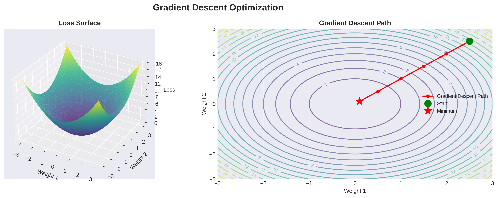

# Lesson 2: Backpropagation & Training 🎓

**Module 5: Neural Networks Foundations | Lesson 2 of 4**

Master backpropagation - the algorithm that makes deep learning possible!

---


## Visual Guides 📊


*Gradient descent optimization on loss surface*

---

## The Training Process 🔄

```
1. Forward Pass: Make predictions
2. Compute Loss: How wrong are we?
3. Backward Pass (Backpropagation): Calculate gradients
4. Update Weights: Gradient descent
5. Repeat!
```

---

## 1. Gradient Descent ⬇️

### Concept

```
Goal: Minimize loss L(w)

Update rule:
w_new = w_old - α × ∂L/∂w

α = learning rate
∂L/∂w = gradient (direction of steepest increase)
```

### Implementation

```python
import numpy as np

def gradient_descent_1d():
    """Simple 1D example: minimize f(x) = x²"""

    def f(x):
        return x ** 2

    def gradient(x):
        return 2 * x

    # Initialize
    x = 10.0
    learning_rate = 0.1
    history = [x]

    # Optimize
    for i in range(50):
        grad = gradient(x)
        x = x - learning_rate * grad
        history.append(x)

        if i % 10 == 0:
            print(f"Step {i}: x={x:.4f}, f(x)={f(x):.4f}")

    return history

history = gradient_descent_1d()

# Visualize
import matplotlib.pyplot as plt

x = np.linspace(-10, 10, 100)
y = x ** 2

plt.plot(x, y, 'b-', label='f(x) = x²')
plt.plot(history, [h**2 for h in history], 'ro-', label='Optimization path')
plt.xlabel('x')
plt.ylabel('f(x)')
plt.legend()
plt.show()
```

---

## 2. Backpropagation Algorithm 🔙

### Chain Rule

```
∂L/∂w₁ = ∂L/∂y × ∂y/∂z × ∂z/∂w₁

Loss → Output → Weighted Sum → Weight
```

### Manual Backprop Example

```python
# Simple network: x → w1 → h → w2 → y
# Loss: MSE

def forward_and_backward_example():
    # Input
    x = 2.0
    y_true = 5.0

    # Weights
    w1 = 0.5
    w2 = 0.8

    # Forward pass
    h = w1 * x          # h = 0.5 * 2 = 1.0
    y_pred = w2 * h     # y = 0.8 * 1 = 0.8

    # Loss
    loss = (y_pred - y_true) ** 2  # (0.8 - 5)² = 17.64

    print(f"Forward: h={h}, y_pred={y_pred}, loss={loss:.4f}")

    # Backward pass (chain rule)
    # ∂L/∂y_pred
    dloss_dy = 2 * (y_pred - y_true)  # 2 * (0.8 - 5) = -8.4

    # ∂L/∂w2 = ∂L/∂y × ∂y/∂w2
    dy_dw2 = h                        # y = w2 * h, so ∂y/∂w2 = h
    dloss_dw2 = dloss_dy * dy_dw2    # -8.4 * 1.0 = -8.4

    # ∂L/∂h = ∂L/∂y × ∂y/∂h
    dy_dh = w2
    dloss_dh = dloss_dy * dy_dh      # -8.4 * 0.8 = -6.72

    # ∂L/∂w1 = ∂L/∂h × ∂h/∂w1
    dh_dw1 = x
    dloss_dw1 = dloss_dh * dh_dw1    # -6.72 * 2.0 = -13.44

    print(f"Gradients: dw1={dloss_dw1:.4f}, dw2={dloss_dw2:.4f}")

    # Update weights
    lr = 0.01
    w1_new = w1 - lr * dloss_dw1     # 0.5 - 0.01*(-13.44) = 0.6344
    w2_new = w2 - lr * dloss_dw2     # 0.8 - 0.01*(-8.4) = 0.884

    print(f"Updated weights: w1={w1_new:.4f}, w2={w2_new:.4f}")

forward_and_backward_example()
```

---

## 3. Complete Neural Network Training 🎯

```python
class NeuralNetwork:
    def __init__(self, input_size, hidden_size, output_size, lr=0.01):
        # Initialize weights
        self.W1 = np.random.randn(input_size, hidden_size) * 0.01
        self.b1 = np.zeros((1, hidden_size))
        self.W2 = np.random.randn(hidden_size, output_size) * 0.01
        self.b2 = np.zeros((1, output_size))

        self.lr = lr

    def sigmoid(self, z):
        return 1 / (1 + np.exp(-z))

    def sigmoid_derivative(self, a):
        return a * (1 - a)

    def forward(self, X):
        """Forward propagation"""
        # Hidden layer
        self.z1 = X @ self.W1 + self.b1
        self.a1 = self.sigmoid(self.z1)

        # Output layer
        self.z2 = self.a1 @ self.W2 + self.b2
        self.a2 = self.sigmoid(self.z2)

        return self.a2

    def backward(self, X, y):
        """Backpropagation"""
        m = X.shape[0]  # Number of samples

        # Output layer gradients
        dz2 = self.a2 - y  # Derivative of BCE w.r.t. z2
        dW2 = (1/m) * (self.a1.T @ dz2)
        db2 = (1/m) * np.sum(dz2, axis=0, keepdims=True)

        # Hidden layer gradients
        dz1 = (dz2 @ self.W2.T) * self.sigmoid_derivative(self.a1)
        dW1 = (1/m) * (X.T @ dz1)
        db1 = (1/m) * np.sum(dz1, axis=0, keepdims=True)

        # Store gradients
        self.gradients = {
            'dW1': dW1, 'db1': db1,
            'dW2': dW2, 'db2': db2
        }

    def update_weights(self):
        """Gradient descent step"""
        self.W1 -= self.lr * self.gradients['dW1']
        self.b1 -= self.lr * self.gradients['db1']
        self.W2 -= self.lr * self.gradients['dW2']
        self.b2 -= self.lr * self.gradients['db2']

    def train(self, X, y, epochs=1000, verbose=True):
        """Training loop"""
        losses = []

        for epoch in range(epochs):
            # Forward
            y_pred = self.forward(X)

            # Loss
            loss = -np.mean(y * np.log(y_pred + 1e-8) +
                           (1 - y) * np.log(1 - y_pred + 1e-8))
            losses.append(loss)

            # Backward
            self.backward(X, y)

            # Update
            self.update_weights()

            if verbose and epoch % 100 == 0:
                accuracy = np.mean((y_pred > 0.5) == y)
                print(f"Epoch {epoch}: Loss={loss:.4f}, Accuracy={accuracy:.4f}")

        return losses

    def predict(self, X):
        """Make predictions"""
        y_pred = self.forward(X)
        return (y_pred > 0.5).astype(int)

# Example: XOR Problem
X = np.array([[0, 0], [0, 1], [1, 0], [1, 1]])
y = np.array([[0], [1], [1], [0]])

# Train
nn = NeuralNetwork(input_size=2, hidden_size=4, output_size=1, lr=0.5)
losses = nn.train(X, y, epochs=5000, verbose=True)

# Test
predictions = nn.predict(X)
print(f"\nPredictions:\n{np.hstack([X, predictions])}")

# Plot loss
plt.plot(losses)
plt.xlabel('Epoch')
plt.ylabel('Loss')
plt.title('Training Loss')
plt.show()
```

---

## 4. Optimization Algorithms 🚀

### SGD with Momentum

```python
class SGDMomentum:
    def __init__(self, learning_rate=0.01, momentum=0.9):
        self.lr = learning_rate
        self.momentum = momentum
        self.velocity = {}

    def update(self, params, grads):
        if not self.velocity:
            for key in params:
                self.velocity[key] = np.zeros_like(params[key])

        for key in params:
            self.velocity[key] = self.momentum * self.velocity[key] - self.lr * grads[key]
            params[key] += self.velocity[key]
```

### Adam (Adaptive Moment Estimation)

```python
class Adam:
    def __init__(self, learning_rate=0.001, beta1=0.9, beta2=0.999, epsilon=1e-8):
        self.lr = learning_rate
        self.beta1 = beta1
        self.beta2 = beta2
        self.epsilon = epsilon
        self.m = {}  # First moment
        self.v = {}  # Second moment
        self.t = 0   # Time step

    def update(self, params, grads):
        if not self.m:
            for key in params:
                self.m[key] = np.zeros_like(params[key])
                self.v[key] = np.zeros_like(params[key])

        self.t += 1

        for key in params:
            # Update biased moments
            self.m[key] = self.beta1 * self.m[key] + (1 - self.beta1) * grads[key]
            self.v[key] = self.beta2 * self.v[key] + (1 - self.beta2) * (grads[key] ** 2)

            # Bias correction
            m_hat = self.m[key] / (1 - self.beta1 ** self.t)
            v_hat = self.v[key] / (1 - self.beta2 ** self.t)

            # Update parameters
            params[key] -= self.lr * m_hat / (np.sqrt(v_hat) + self.epsilon)
```

---

## 5. Mini-Batch Training 📦

```python
def create_mini_batches(X, y, batch_size=32):
    """Split data into mini-batches"""
    m = X.shape[0]
    mini_batches = []

    # Shuffle
    permutation = np.random.permutation(m)
    X_shuffled = X[permutation]
    y_shuffled = y[permutation]

    # Create mini-batches
    num_complete_batches = m // batch_size

    for k in range(num_complete_batches):
        X_batch = X_shuffled[k * batch_size:(k + 1) * batch_size]
        y_batch = y_shuffled[k * batch_size:(k + 1) * batch_size]
        mini_batches.append((X_batch, y_batch))

    # Handle remaining samples
    if m % batch_size != 0:
        X_batch = X_shuffled[num_complete_batches * batch_size:]
        y_batch = y_shuffled[num_complete_batches * batch_size:]
        mini_batches.append((X_batch, y_batch))

    return mini_batches

# Training with mini-batches
def train_with_mini_batches(model, X, y, epochs=100, batch_size=32):
    for epoch in range(epochs):
        mini_batches = create_mini_batches(X, y, batch_size)

        epoch_loss = 0
        for X_batch, y_batch in mini_batches:
            # Forward
            y_pred = model.forward(X_batch)

            # Loss
            loss = binary_cross_entropy(y_batch, y_pred)
            epoch_loss += loss

            # Backward
            model.backward(X_batch, y_batch)

            # Update
            model.update_weights()

        if epoch % 10 == 0:
            print(f"Epoch {epoch}: Loss={epoch_loss/len(mini_batches):.4f}")
```

---

## 6. Learning Rate Scheduling 📈

```python
class LearningRateScheduler:
    def __init__(self, initial_lr=0.1):
        self.initial_lr = initial_lr

    def step_decay(self, epoch, drop=0.5, epochs_drop=10):
        """Reduce LR every N epochs"""
        return self.initial_lr * (drop ** (epoch // epochs_drop))

    def exponential_decay(self, epoch, decay_rate=0.95):
        """Exponential decay"""
        return self.initial_lr * (decay_rate ** epoch)

    def cosine_annealing(self, epoch, T_max=100):
        """Cosine annealing"""
        return self.initial_lr * 0.5 * (1 + np.cos(np.pi * epoch / T_max))

# Example
scheduler = LearningRateScheduler(initial_lr=0.1)

epochs = 100
lrs = []

for epoch in range(epochs):
    lr = scheduler.cosine_annealing(epoch, T_max=epochs)
    lrs.append(lr)

plt.plot(lrs)
plt.xlabel('Epoch')
plt.ylabel('Learning Rate')
plt.title('Cosine Annealing Schedule')
plt.show()
```

---

## Quick Reference 📖

**Training Loop:**

```python
for epoch in range(num_epochs):
    # Mini-batch loop
    for X_batch, y_batch in data_loader:
        # 1. Forward
        y_pred = model.forward(X_batch)

        # 2. Loss
        loss = loss_function(y_batch, y_pred)

        # 3. Backward
        model.backward(X_batch, y_batch)

        # 4. Update
        optimizer.update(model.params, model.grads)
```

**Common Learning Rates:**
- **SGD:** 0.01 - 0.1
- **Adam:** 0.001 - 0.01
- **RMSprop:** 0.001

**Optimization Methods:**
- **SGD:** Simple, needs tuning
- **Momentum:** Faster convergence
- **Adam:** **Default choice** (adaptive, robust)
- **RMSprop:** Good for RNNs

---

## Key Takeaways 💡

1. **Backpropagation** = chain rule applied recursively
2. **Gradient descent** minimizes loss by following gradients
3. **Mini-batches** balance speed and stability
4. **Adam optimizer** is default choice
5. **Learning rate** is most important hyperparameter
6. **Learning rate scheduling** improves training
7. **Always shuffle data** between epochs

---

**Next:** [Lesson 3 - Regularization & Best Practices →](Lesson%203%20-%20Regularization%20and%20Best%20Practices.md)
