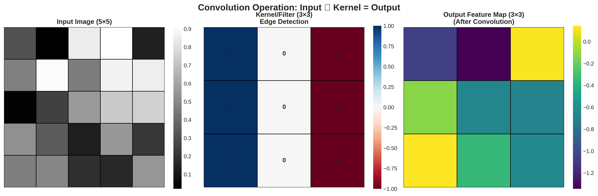
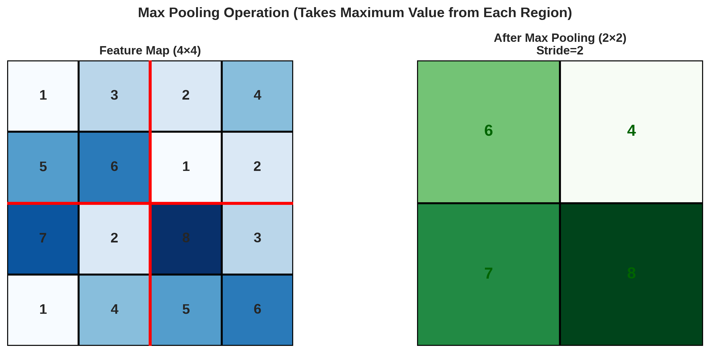
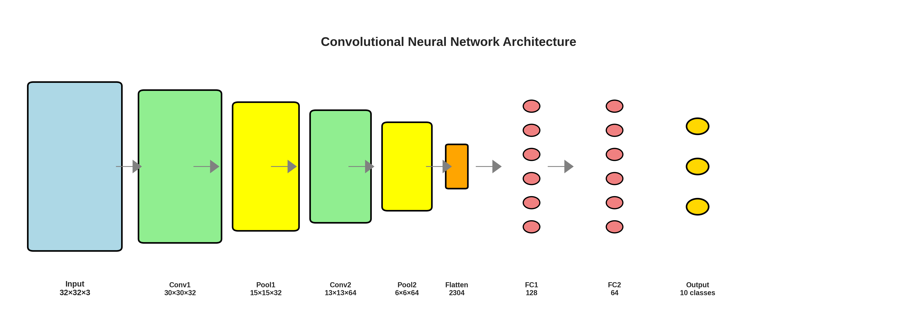

# Lesson 1: Convolutional Neural Networks (CNNs) 🖼️

**Module 6: Deep Learning for Computer Vision | Lesson 1 of 4**

Master CNNs - the backbone of modern computer vision!

---


## Visual Guides 📊


*Convolution operation - filter applied to input*


*Max pooling reduces spatial dimensions*


*Complete CNN architecture*

---

## Why CNNs for Images?

**Fully connected networks fail for images:**
- Too many parameters (256×256 RGB image = 196,608 inputs!)
- No spatial structure awareness
- No translation invariance

**CNNs solve this:**
- Local connectivity
- Weight sharing
- Translation invariance
- Hierarchical feature learning

---

## 1. Convolution Operation 🔍

```python
import numpy as np
import torch
import torch.nn as nn

# Manual convolution
def convolve2d(image, kernel):
    """Simple 2D convolution"""
    i_height, i_width = image.shape
    k_height, k_width = kernel.shape

    output_height = i_height - k_height + 1
    output_width = i_width - k_width + 1

    output = np.zeros((output_height, output_width))

    for i in range(output_height):
        for j in range(output_width):
            output[i, j] = np.sum(
                image[i:i+k_height, j:j+k_width] * kernel
            )

    return output

# Example: Edge detection
image = np.array([
    [0, 0, 0, 200, 200, 200],
    [0, 0, 0, 200, 200, 200],
    [0, 0, 0, 200, 200, 200],
    [0, 0, 0, 200, 200, 200]
])

# Vertical edge detector
kernel = np.array([
    [-1, 0, 1],
    [-1, 0, 1],
    [-1, 0, 1]
])

edges = convolve2d(image, kernel)
print("Edge detection:\n", edges)

# PyTorch convolution
conv = nn.Conv2d(in_channels=1, out_channels=1, kernel_size=3, bias=False)
# Set custom kernel
conv.weight.data = torch.tensor([[[[- 1, 0, 1],
                                     [-1, 0, 1],
                                     [-1, 0, 1]]]]).float()

image_tensor = torch.tensor(image).float().unsqueeze(0).unsqueeze(0)
output = conv(image_tensor)
print("PyTorch output:\n", output.squeeze())
```

---

## 2. CNN Layers 🏗️

### Convolutional Layer

```python
# Conv2d parameters
conv = nn.Conv2d(
    in_channels=3,      # RGB input
    out_channels=16,    # 16 filters
    kernel_size=3,      # 3×3 filter
    stride=1,           # Move 1 pixel at a time
    padding=1           # Zero padding
)

# Input: (batch, channels, height, width)
x = torch.randn(1, 3, 32, 32)  # Batch of 1, RGB image 32×32
output = conv(x)
print(f"Output shape: {output.shape}")  # (1, 16, 32, 32)
```

### Pooling Layer

```python
# Max pooling
maxpool = nn.MaxPool2d(kernel_size=2, stride=2)
x = torch.randn(1, 16, 32, 32)
output = maxpool(x)
print(f"After pooling: {output.shape}")  # (1, 16, 16, 16)

# Average pooling
avgpool = nn.AvgPool2d(kernel_size=2, stride=2)

# Global average pooling (reduce to 1×1)
gap = nn.AdaptiveAvgPool2d((1, 1))
output = gap(x)
print(f"Global pooling: {output.shape}")  # (1, 16, 1, 1)
```

---

## 3. Complete CNN Architecture 🎯

```python
class SimpleCNN(nn.Module):
    def __init__(self, num_classes=10):
        super(SimpleCNN, self).__init__()

        # Convolutional layers
        self.conv1 = nn.Conv2d(3, 32, kernel_size=3, padding=1)
        self.bn1 = nn.BatchNorm2d(32)
        self.conv2 = nn.Conv2d(32, 64, kernel_size=3, padding=1)
        self.bn2 = nn.BatchNorm2d(64)
        self.conv3 = nn.Conv2d(64, 128, kernel_size=3, padding=1)
        self.bn3 = nn.BatchNorm2d(128)

        # Pooling
        self.pool = nn.MaxPool2d(2, 2)

        # Fully connected layers
        self.fc1 = nn.Linear(128 * 4 * 4, 512)
        self.dropout = nn.Dropout(0.5)
        self.fc2 = nn.Linear(512, num_classes)

    def forward(self, x):
        # Conv block 1
        x = self.conv1(x)         # 32×32×32
        x = self.bn1(x)
        x = F.relu(x)
        x = self.pool(x)          # 16×16×32

        # Conv block 2
        x = self.conv2(x)         # 16×16×64
        x = self.bn2(x)
        x = F.relu(x)
        x = self.pool(x)          # 8×8×64

        # Conv block 3
        x = self.conv3(x)         # 8×8×128
        x = self.bn3(x)
        x = F.relu(x)
        x = self.pool(x)          # 4×4×128

        # Flatten
        x = x.view(x.size(0), -1)  # Flatten to vector

        # FC layers
        x = self.fc1(x)
        x = F.relu(x)
        x = self.dropout(x)
        x = self.fc2(x)

        return x

# Create model
model = SimpleCNN(num_classes=10)
print(model)

# Test
x = torch.randn(1, 3, 32, 32)
output = model(x)
print(f"Output shape: {output.shape}")  # (1, 10)
```

---

## 4. CIFAR-10 Example 📸

```python
import torchvision
import torchvision.transforms as transforms

# Data preprocessing
transform = transforms.Compose([
    transforms.ToTensor(),
    transforms.Normalize((0.5, 0.5, 0.5), (0.5, 0.5, 0.5))
])

# Load CIFAR-10
trainset = torchvision.datasets.CIFAR10(root='./data', train=True,
                                        download=True, transform=transform)
trainloader = torch.utils.data.DataLoader(trainset, batch_size=128,
                                          shuffle=True, num_workers=2)

testset = torchvision.datasets.CIFAR10(root='./data', train=False,
                                       download=True, transform=transform)
testloader = torch.utils.data.DataLoader(testset, batch_size=128,
                                         shuffle=False, num_workers=2)

classes = ('plane', 'car', 'bird', 'cat', 'deer',
           'dog', 'frog', 'horse', 'ship', 'truck')

# Train
device = torch.device("cuda" if torch.cuda.is_available() else "cpu")
model = SimpleCNN().to(device)
criterion = nn.CrossEntropyLoss()
optimizer = torch.optim.Adam(model.parameters(), lr=0.001)

def train(epoch):
    model.train()
    running_loss = 0.0

    for i, (inputs, labels) in enumerate(trainloader):
        inputs, labels = inputs.to(device), labels.to(device)

        optimizer.zero_grad()
        outputs = model(inputs)
        loss = criterion(outputs, labels)
        loss.backward()
        optimizer.step()

        running_loss += loss.item()

        if i % 100 == 99:
            print(f'[{epoch + 1}, {i + 1}] loss: {running_loss / 100:.3f}')
            running_loss = 0.0

def test():
    model.eval()
    correct = 0
    total = 0

    with torch.no_grad():
        for inputs, labels in testloader:
            inputs, labels = inputs.to(device), labels.to(device)
            outputs = model(inputs)
            _, predicted = torch.max(outputs.data, 1)
            total += labels.size(0)
            correct += (predicted == labels).sum().item()

    print(f'Accuracy: {100 * correct / total:.2f}%')

# Train for 10 epochs
for epoch in range(10):
    train(epoch)
    test()
```

---

## 5. Receptive Field 🔭

```python
def calculate_receptive_field(layers):
    """Calculate receptive field size"""
    rf = 1
    jump = 1

    for layer in reversed(layers):
        if layer['type'] == 'conv':
            rf += (layer['kernel'] - 1) * jump
            jump *= layer['stride']
        elif layer['type'] == 'pool':
            rf += (layer['kernel'] - 1) * jump
            jump *= layer['stride']

    return rf

# Example architecture
layers = [
    {'type': 'conv', 'kernel': 3, 'stride': 1},
    {'type': 'pool', 'kernel': 2, 'stride': 2},
    {'type': 'conv', 'kernel': 3, 'stride': 1},
    {'type': 'pool', 'kernel': 2, 'stride': 2},
]

rf = calculate_receptive_field(layers)
print(f"Receptive field: {rf}×{rf}")
```

---

## 6. Data Augmentation 🔄

```python
# Training transforms (with augmentation)
train_transform = transforms.Compose([
    transforms.RandomCrop(32, padding=4),
    transforms.RandomHorizontalFlip(),
    transforms.RandomRotation(15),
    transforms.ColorJitter(brightness=0.2, contrast=0.2),
    transforms.ToTensor(),
    transforms.Normalize((0.5, 0.5, 0.5), (0.5, 0.5, 0.5))
])

# Test transforms (no augmentation)
test_transform = transforms.Compose([
    transforms.ToTensor(),
    transforms.Normalize((0.5, 0.5, 0.5), (0.5, 0.5, 0.5))
])

# Apply
trainset = torchvision.datasets.CIFAR10(root='./data', train=True,
                                        transform=train_transform)
```

---

## Quick Reference 📖

**CNN Building Blocks:**
```python
# Convolutional block
conv_block = nn.Sequential(
    nn.Conv2d(in_ch, out_ch, kernel_size=3, padding=1),
    nn.BatchNorm2d(out_ch),
    nn.ReLU(),
    nn.MaxPool2d(2, 2)
)
```

**Common Patterns:**
- **Early layers:** Small kernels (3×3), more channels
- **Later layers:** Keep same number of channels
- **Pooling:** Reduce spatial dimensions, keep channels
- **Final layers:** Global pooling + FC

**Typical Architecture:**
```
Input (3×224×224)
→ Conv (64 filters)
→ Pool
→ Conv (128 filters)
→ Pool
→ Conv (256 filters)
→ Pool
→ Conv (512 filters)
→ Global Pool
→ FC (1000 classes)
```

---

## Key Takeaways 💡

1. **CNNs** extract hierarchical features from images
2. **Convolution** = local connectivity + weight sharing
3. **Pooling** reduces spatial dimensions
4. **Deeper** networks learn more complex features
5. **Batch norm** accelerates training
6. **Data augmentation** crucial for small datasets
7. **Start simple**, increase complexity as needed

---

**Next:** [Lesson 2 - Advanced CNN Architectures →](Lesson%202%20-%20Advanced%20CNN%20Architectures.md)
