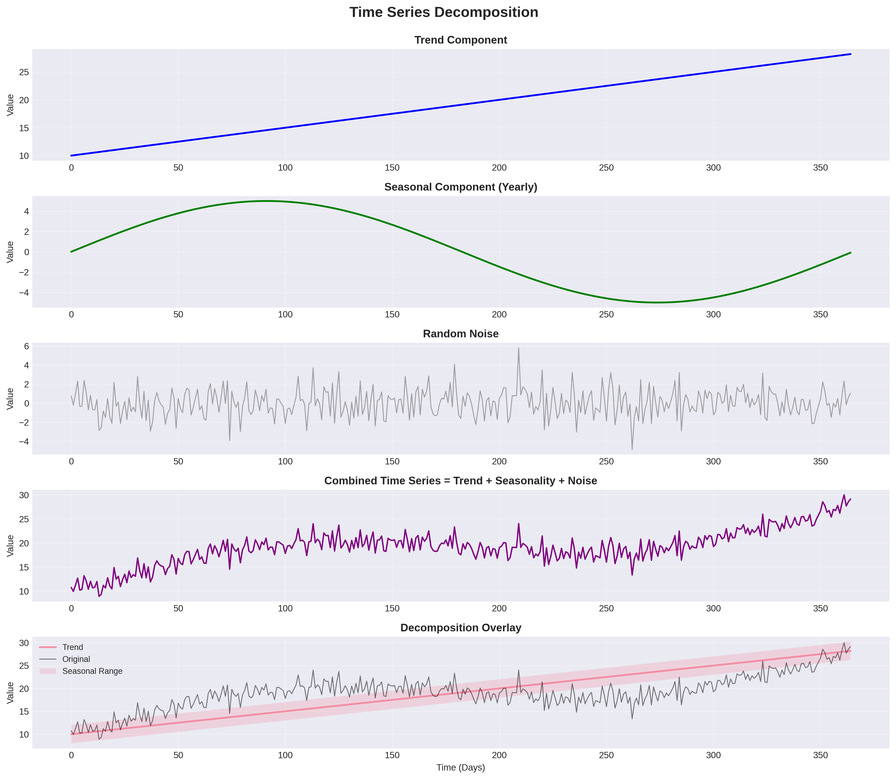
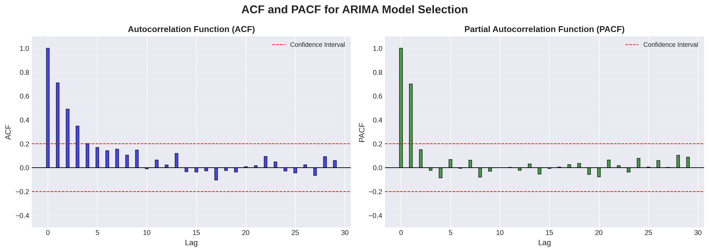

# Lesson 1: Time Series Fundamentals ⏰

**Module 7: Time Series & Forecasting | Lesson 1 of 4**

Master time series basics - data indexed by time!

---


## Visual Guides 📊


*Time series decomposition: trend + seasonality + noise*


*ACF and PACF plots for ARIMA model selection*

---

## What is Time Series?

**Data points indexed in time order:**
- Stock prices
- Weather data
- Website traffic
- Sales forecasts
- Sensor readings

---

## 1. Components of Time Series 📊

```python
import pandas as pd
import numpy as np
import matplotlib.pyplot as plt

# Generate example time series
date_range = pd.date_range(start='2020-01-01', end='2023-12-31', freq='D')

# Components
trend = np.linspace(100, 200, len(date_range))
seasonal = 10 * np.sin(2 * np.pi * np.arange(len(date_range)) / 365)
noise = np.random.randn(len(date_range)) * 5

ts = trend + seasonal + noise

df = pd.DataFrame({'date': date_range, 'value': ts})
df.set_index('date', inplace=True)

# Visualize
plt.figure(figsize=(12, 4))
plt.plot(df.index, df['value'])
plt.title('Time Series Example')
plt.show()
```

**Components:**
1. **Trend:** Long-term increase/decrease
2. **Seasonality:** Regular periodic patterns
3. **Cycles:** Non-fixed periodic patterns
4. **Noise:** Random variation

---

## 2. Stationarity 📈

**Stationary series:** Statistical properties constant over time
- Constant mean
- Constant variance
- Autocovariance doesn't depend on time

```python
from statsmodels.tsa.stattools import adfuller

# Augmented Dickey-Fuller test
def test_stationarity(timeseries):
    """Test if series is stationary"""
    result = adfuller(timeseries.dropna())

    print('ADF Statistic:', result[0])
    print('p-value:', result[1])

    if result[1] <= 0.05:
        print("✅ Series is stationary")
    else:
        print("❌ Series is non-stationary")

    return result[1] <= 0.05

# Test
test_stationarity(df['value'])
```

**Making series stationary:**

```python
# Method 1: Differencing
df['diff'] = df['value'].diff()

# Method 2: Log transform
df['log'] = np.log(df['value'])

# Method 3: Detrend
from scipy import signal
df['detrended'] = signal.detrend(df['value'])

# Test again
test_stationarity(df['diff'].dropna())
```

---

## 3. Autocorrelation 🔄

```python
from statsmodels.graphics.tsaplots import plot_acf, plot_pacf

# ACF (Autocorrelation Function)
fig, axes = plt.subplots(1, 2, figsize=(12, 4))

plot_acf(df['value'].dropna(), lags=40, ax=axes[0])
axes[0].set_title('ACF')

# PACF (Partial Autocorrelation Function)
plot_pacf(df['value'].dropna(), lags=40, ax=axes[1])
axes[1].set_title('PACF')

plt.show()
```

---

## 4. Train/Test Split 🔪

```python
# Temporal split (NO shuffling!)
train_size = int(len(df) * 0.8)

train = df[:train_size]
test = df[train_size:]

print(f"Train: {train.index[0]} to {train.index[-1]}")
print(f"Test: {test.index[0]} to {test.index[-1]}")

# Visualize
plt.figure(figsize=(12, 4))
plt.plot(train.index, train['value'], label='Train')
plt.plot(test.index, test['value'], label='Test')
plt.legend()
plt.show()
```

---

## 5. Baseline Models 📉

### Naive Forecast

```python
# Predict tomorrow = today
naive_forecast = test['value'].shift(1)

from sklearn.metrics import mean_absolute_error, mean_squared_error

mae = mean_absolute_error(test['value'][1:], naive_forecast[1:])
print(f"Naive MAE: {mae:.2f}")
```

### Moving Average

```python
def moving_average_forecast(series, window=7):
    """Simple moving average"""
    return series.rolling(window=window).mean()

ma_forecast = moving_average_forecast(train['value'], window=7)

# Extend to test set
last_values = train['value'].tail(7)
test_forecast = []

for _ in range(len(test)):
    pred = last_values.mean()
    test_forecast.append(pred)
    last_values = last_values.iloc[1:].append(pd.Series([pred]))

mae = mean_absolute_error(test['value'], test_forecast)
print(f"MA MAE: {mae:.2f}")
```

---

## Quick Reference 📖

**Time Series Checklist:**
```
✅ Check for stationarity (ADF test)
✅ Make stationary (differencing/log)
✅ Analyze ACF/PACF
✅ Split chronologically
✅ Start with simple baseline
```

**Common Transformations:**
- Differencing: `df.diff()`
- Log: `np.log(df)`
- Square root: `np.sqrt(df)`

---

## Key Takeaways 💡

1. Time series = data indexed by time
2. **Stationarity** required for many models
3. **Differencing** makes series stationary
4. **NO random shuffling** in time series!
5. **Autocorrelation** shows patterns
6. **Always start** with simple baselines

---

**Next:** [Lesson 2 - ARIMA & Statistical Methods →](Lesson%202%20-%20ARIMA%20and%20Statistical%20Methods.md)
