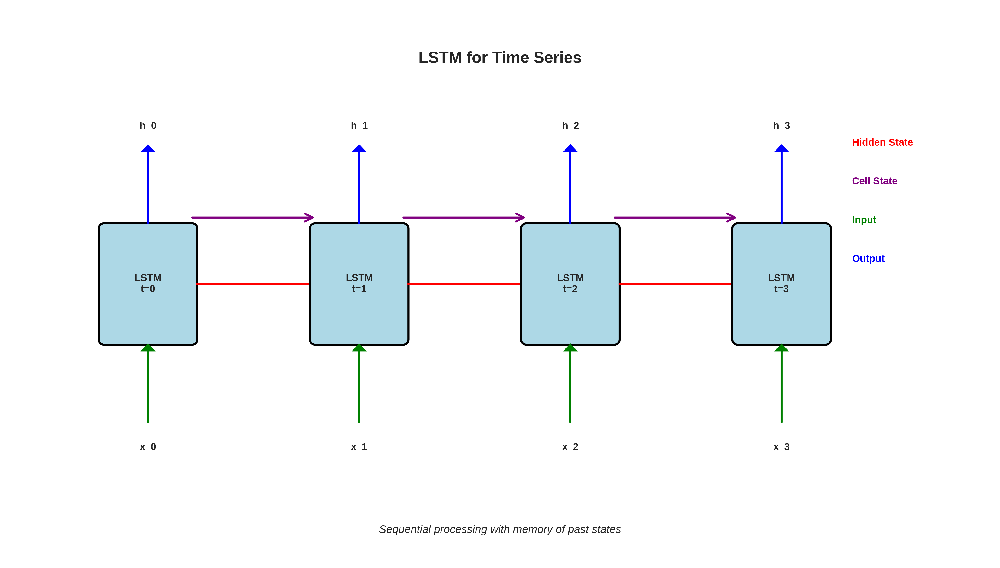

# Lesson 4: Deep Learning for Time Series 🧠

**Module 7: Time Series & Forecasting | Lesson 4 of 4**

Master LSTM, GRU, and Transformers for time series forecasting!

---


## Visual Guides 📊


*LSTM architecture for sequential data*

---

## Why Deep Learning?

**Advantages:**
- Automatic feature learning
- Capture complex patterns
- Multivariate forecasting
- Non-linear relationships

---

## 1. LSTM (Long Short-Term Memory) 🔄

```python
import torch
import torch.nn as nn

class LSTMForecaster(nn.Module):
    def __init__(self, input_size=1, hidden_size=50, num_layers=2, output_size=1):
        super(LSTMForecaster, self).__init__()

        self.hidden_size = hidden_size
        self.num_layers = num_layers

        self.lstm = nn.LSTM(input_size, hidden_size, num_layers, batch_first=True)
        self.fc = nn.Linear(hidden_size, output_size)

    def forward(self, x):
        # Initialize hidden state
        h0 = torch.zeros(self.num_layers, x.size(0), self.hidden_size)
        c0 = torch.zeros(self.num_layers, x.size(0), self.hidden_size)

        # LSTM
        out, _ = self.lstm(x, (h0, c0))

        # Last time step
        out = self.fc(out[:, -1, :])

        return out

# Create model
model = LSTMForecaster(input_size=1, hidden_size=50, num_layers=2)
print(model)
```

---

## 2. Data Preparation 📊

```python
def create_sequences(data, seq_length):
    """Create sequences for LSTM"""
    X, y = [], []

    for i in range(len(data) - seq_length):
        X.append(data[i:i+seq_length])
        y.append(data[i+seq_length])

    return np.array(X), np.array(y)

# Example
data = df['value'].values
seq_length = 30  # Use last 30 days to predict next day

X, y = create_sequences(data, seq_length)

# Reshape for LSTM: (samples, seq_length, features)
X = X.reshape((X.shape[0], X.shape[1], 1))

print(f"X shape: {X.shape}")  # (samples, 30, 1)
print(f"y shape: {y.shape}")  # (samples,)

# Normalize
from sklearn.preprocessing import MinMaxScaler

scaler = MinMaxScaler()
X = scaler.fit_transform(X.reshape(-1, 1)).reshape(X.shape)
y = scaler.transform(y.reshape(-1, 1)).flatten()

# Train/test split
train_size = int(len(X) * 0.8)

X_train, X_test = X[:train_size], X[train_size:]
y_train, y_test = y[:train_size], y[train_size:]

# Convert to tensors
X_train = torch.FloatTensor(X_train)
y_train = torch.FloatTensor(y_train)
X_test = torch.FloatTensor(X_test)
y_test = torch.FloatTensor(y_test)
```

---

## 3. Training LSTM 🎯

```python
model = LSTMForecaster(input_size=1, hidden_size=50, num_layers=2)
criterion = nn.MSELoss()
optimizer = torch.optim.Adam(model.parameters(), lr=0.001)

# Training loop
epochs = 100
losses = []

for epoch in range(epochs):
    model.train()

    # Forward
    outputs = model(X_train)
    loss = criterion(outputs.squeeze(), y_train)

    # Backward
    optimizer.zero_grad()
    loss.backward()
    optimizer.step()

    losses.append(loss.item())

    if (epoch + 1) % 10 == 0:
        print(f'Epoch [{epoch+1}/{epochs}], Loss: {loss.item():.6f}')

# Plot loss
plt.plot(losses)
plt.xlabel('Epoch')
plt.ylabel('Loss')
plt.title('Training Loss')
plt.show()
```

---

## 4. Evaluation & Prediction 📈

```python
model.eval()

with torch.no_grad():
    # Test predictions
    test_pred = model(X_test).squeeze().numpy()

# Inverse transform
test_pred = scaler.inverse_transform(test_pred.reshape(-1, 1)).flatten()
y_test_original = scaler.inverse_transform(y_test.numpy().reshape(-1, 1)).flatten()

# Metrics
mae = mean_absolute_error(y_test_original, test_pred)
rmse = np.sqrt(mean_squared_error(y_test_original, test_pred))

print(f"MAE: {mae:.2f}")
print(f"RMSE: {rmse:.2f}")

# Plot
plt.figure(figsize=(12, 4))
plt.plot(y_test_original, label='Actual')
plt.plot(test_pred, label='Predicted')
plt.legend()
plt.title('LSTM Forecast')
plt.show()
```

---

## 5. Multivariate Forecasting 🎯

```python
# Multiple input features
class MultivariateLSTM(nn.Module):
    def __init__(self, input_size=5, hidden_size=50, num_layers=2, output_size=1):
        super(MultivariateLSTM, self).__init__()

        self.lstm = nn.LSTM(input_size, hidden_size, num_layers, batch_first=True)
        self.fc = nn.Linear(hidden_size, output_size)

    def forward(self, x):
        h0 = torch.zeros(self.num_layers, x.size(0), self.hidden_size)
        c0 = torch.zeros(self.num_layers, x.size(0), self.hidden_size)

        out, _ = self.lstm(x, (h0, c0))
        out = self.fc(out[:, -1, :])

        return out

# Example: predict sales using [sales, price, promotion, weather, day_of_week]
model = MultivariateLSTM(input_size=5, hidden_size=50)

# Data shape: (samples, seq_length, 5_features)
```

---

## 6. Transformer for Time Series ⚡

```python
class TimeSeriesTransformer(nn.Module):
    def __init__(self, input_size=1, d_model=64, nhead=4, num_layers=2, output_size=1):
        super().__init__()

        self.input_proj = nn.Linear(input_size, d_model)

        encoder_layer = nn.TransformerEncoderLayer(d_model=d_model, nhead=nhead)
        self.transformer = nn.TransformerEncoder(encoder_layer, num_layers=num_layers)

        self.output_proj = nn.Linear(d_model, output_size)

    def forward(self, x):
        # x: (batch, seq_len, input_size)

        x = self.input_proj(x)  # (batch, seq_len, d_model)
        x = x.permute(1, 0, 2)  # (seq_len, batch, d_model)

        x = self.transformer(x)  # (seq_len, batch, d_model)

        x = x[-1]  # Last time step: (batch, d_model)
        x = self.output_proj(x)  # (batch, output_size)

        return x

# Create model
model = TimeSeriesTransformer(input_size=1, d_model=64, nhead=4, num_layers=2)
```

---

## Quick Reference 📖

**LSTM Template:**
```python
class LSTM(nn.Module):
    def __init__(self):
        super().__init__()
        self.lstm = nn.LSTM(input_size, hidden_size, num_layers, batch_first=True)
        self.fc = nn.Linear(hidden_size, output_size)

    def forward(self, x):
        out, _ = self.lstm(x)
        out = self.fc(out[:, -1, :])
        return out
```

**Sequence Creation:**
```python
def create_sequences(data, seq_len):
    X, y = [], []
    for i in range(len(data) - seq_len):
        X.append(data[i:i+seq_len])
        y.append(data[i+seq_len])
    return np.array(X), np.array(y)
```

---

## Key Takeaways 💡

1. **LSTM** remembers long-term dependencies
2. **Sequence creation** critical for DL models
3. **Always normalize** time series data
4. **Multivariate** models use multiple features
5. **Transformers** emerging for time series
6. DL works best with **large datasets**

---

**Module 7 Complete!** 🎉

**Next Module:** [Module 8 - Recommender Systems →](../Module%208%20-%20Recommender%20Systems/Lesson%201%20-%20Collaborative%20Filtering.md)
