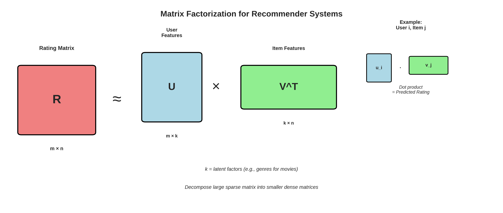

# Lesson 3: Matrix Factorization 🔢

**Module 8: Recommender Systems | Lesson 3 of 4**

Master matrix factorization - Netflix Prize winning technique!

---


## Visual Guides 📊


*Matrix factorization into user and item features*

---

## Idea

**Decompose rating matrix into user and item factors**

```
R (m×n) ≈ U (m×k) × V^T (k×n)

R: ratings
U: user factors
V: item factors
k: latent factors (hidden features)
```

---

## 1. SVD (Singular Value Decomposition) 📊

```python
from surprise import SVD, Dataset
from surprise.model_selection import cross_validate

# Load data
data = Dataset.load_builtin('ml-100k')

# SVD
algo = SVD(
    n_factors=100,  # Number of latent factors
    n_epochs=20,    # Training iterations
    lr_all=0.005,   # Learning rate
    reg_all=0.02    # Regularization
)

# Cross-validate
results = cross_validate(algo, data, measures=['RMSE', 'MAE'], cv=5)

print(f"RMSE: {results['test_rmse'].mean():.3f}")
print(f"MAE: {results['test_mae'].mean():.3f}")
```

---

## 2. Manual Implementation 🛠️

```python
class MatrixFactorization:
    def __init__(self, n_factors=20, learning_rate=0.01, reg=0.02, n_epochs=100):
        self.n_factors = n_factors
        self.lr = learning_rate
        self.reg = reg
        self.n_epochs = n_epochs

    def fit(self, ratings):
        """
        ratings: list of (user_id, item_id, rating)
        """
        # Get dimensions
        user_ids = set([r[0] for r in ratings])
        item_ids = set([r[1] for r in ratings])

        n_users = max(user_ids) + 1
        n_items = max(item_ids) + 1

        # Initialize factors
        self.user_factors = np.random.normal(0, 0.1, (n_users, self.n_factors))
        self.item_factors = np.random.normal(0, 0.1, (n_items, self.n_factors))

        # Biases
        self.user_bias = np.zeros(n_users)
        self.item_bias = np.zeros(n_items)
        self.global_mean = np.mean([r[2] for r in ratings])

        # Train
        for epoch in range(self.n_epochs):
            np.random.shuffle(ratings)

            for user_id, item_id, rating in ratings:
                # Predict
                pred = self.predict(user_id, item_id)

                # Error
                error = rating - pred

                # Update factors
                self.user_factors[user_id] += self.lr * (
                    error * self.item_factors[item_id] -
                    self.reg * self.user_factors[user_id]
                )

                self.item_factors[item_id] += self.lr * (
                    error * self.user_factors[user_id] -
                    self.reg * self.item_factors[item_id]
                )

                # Update biases
                self.user_bias[user_id] += self.lr * (error - self.reg * self.user_bias[user_id])
                self.item_bias[item_id] += self.lr * (error - self.reg * self.item_bias[item_id])

            if epoch % 10 == 0:
                rmse = self.compute_rmse(ratings)
                print(f"Epoch {epoch}: RMSE = {rmse:.3f}")

    def predict(self, user_id, item_id):
        """Predict rating"""
        pred = self.global_mean
        pred += self.user_bias[user_id]
        pred += self.item_bias[item_id]
        pred += self.user_factors[user_id] @ self.item_factors[item_id]
        return pred

    def compute_rmse(self, ratings):
        """Compute RMSE"""
        errors = []
        for user_id, item_id, rating in ratings:
            pred = self.predict(user_id, item_id)
            errors.append((rating - pred) ** 2)
        return np.sqrt(np.mean(errors))

# Example
ratings = [
    (0, 0, 5), (0, 1, 3), (0, 3, 1),
    (1, 0, 4), (1, 3, 1),
    (2, 0, 1), (2, 1, 1), (2, 3, 5),
    (3, 0, 1), (3, 3, 4),
    (4, 1, 1), (4, 2, 5), (4, 3, 4),
]

mf = MatrixFactorization(n_factors=10, n_epochs=100)
mf.fit(ratings)

# Predict
pred = mf.predict(0, 2)  # User 0, Item 2
print(f"Predicted rating: {pred:.2f}")
```

---

## 3. NMF (Non-Negative Matrix Factorization) ⚡

```python
from surprise import NMF

algo = NMF(
    n_factors=15,
    n_epochs=50,
    reg_pu=0.06,
    reg_qi=0.06
)

# Cross-validate
results = cross_validate(algo, data, measures=['RMSE'], cv=5)
print(f"NMF RMSE: {results['test_rmse'].mean():.3f}")
```

---

## 4. Implicit Feedback 👀

```python
from implicit.als import AlternatingLeastSquares
import scipy.sparse as sparse

# Convert to sparse matrix
# rows: users, cols: items, values: confidence

user_items = sparse.csr_matrix((
    np.ones(len(ratings)),  # All 1s (implicit feedback)
    ([r[0] for r in ratings], [r[1] for r in ratings])
))

# ALS model
model = AlternatingLeastSquares(
    factors=50,
    regularization=0.01,
    iterations=15
)

model.fit(user_items)

# Get recommendations
user_id = 0
recommendations = model.recommend(
    user_id,
    user_items[user_id],
    N=10,
    filter_already_liked_items=True
)

print(f"Recommendations for user {user_id}:")
for item_id, score in recommendations:
    print(f"  Item {item_id}: {score:.3f}")
```

---

## Quick Reference 📖

**Matrix Factorization Benefits:**
- Handles sparsity well
- Discovers latent factors
- Scalable
- State-of-the-art accuracy

**Algorithms:**
- **SVD:** Classic approach
- **ALS:** Implicit feedback
- **NMF:** Non-negative (interpretable)

---

## Key Takeaways 💡

1. **Matrix factorization** learns latent factors
2. **SVD** = standard approach
3. **Regularization** prevents overfitting
4. **More factors** = more expressive but can overfit
5. **Implicit feedback** (views, clicks) more common
6. **ALS** parallelizable for large scale

---

**Next:** [Lesson 4 - Neural Recommenders →](Lesson%204%20-%20Neural%20Recommenders.md)
