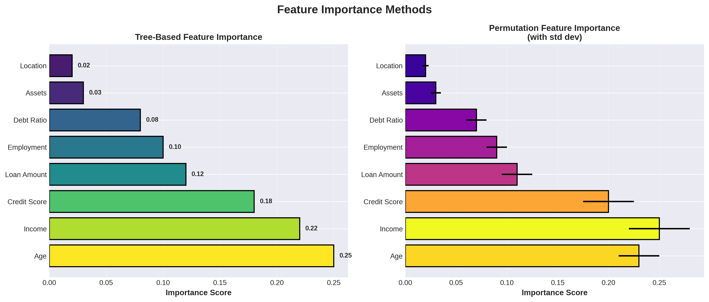
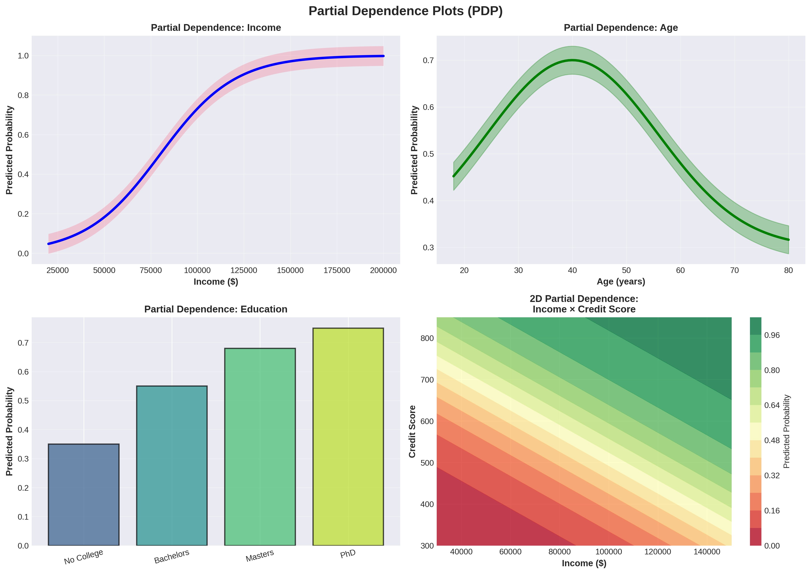

# Lesson 1: Feature Importance 📊

**Module 9: Explainable AI | Lesson 1 of 4**

Understand which features drive your model's predictions!

---


## Visual Guides 📊


*Feature importance methods comparison*


*Partial dependence plots*

---

## Why Explainability?

**Black box models need explanation:**
- Debugging models
- Building trust
- Regulatory compliance
- Business insights

---

## 1. Tree-Based Feature Importance 🌳

```python
from sklearn.ensemble import RandomForestClassifier
from sklearn.datasets import load_breast_cancer
import pandas as pd
import matplotlib.pyplot as plt

# Load data
data = load_breast_cancer()
X, y = data.data, data.target

# Train
rf = RandomForestClassifier(n_estimators=100, random_state=42)
rf.fit(X, y)

# Feature importance
importances = rf.feature_importances_
feature_names = data.feature_names

# Create DataFrame
importance_df = pd.DataFrame({
    'feature': feature_names,
    'importance': importances
}).sort_values('importance', ascending=False)

# Plot
plt.figure(figsize=(10, 6))
plt.barh(importance_df['feature'][:10], importance_df['importance'][:10])
plt.xlabel('Importance')
plt.title('Top 10 Feature Importances')
plt.gca().invert_yaxis()
plt.show()

print(importance_df.head(10))
```

---

## 2. Permutation Importance ⚡

```python
from sklearn.inspection import permutation_importance

# Calculate permutation importance
result = permutation_importance(
    rf, X, y,
    n_repeats=10,
    random_state=42,
    n_jobs=-1
)

# Get importances
perm_importance_df = pd.DataFrame({
    'feature': feature_names,
    'importance': result.importances_mean,
    'std': result.importances_std
}).sort_values('importance', ascending=False)

# Plot
plt.figure(figsize=(10, 6))
plt.barh(perm_importance_df['feature'][:10],
        perm_importance_df['importance'][:10],
        xerr=perm_importance_df['std'][:10])
plt.xlabel('Permutation Importance')
plt.title('Top 10 Features (Permutation)')
plt.gca().invert_yaxis()
plt.show()

print(perm_importance_df.head(10))
```

**Permutation Importance:**
- Shuffle feature values
- Measure drop in performance
- More reliable than tree importance

---

## 3. Linear Model Coefficients 📈

```python
from sklearn.linear_model import LogisticRegression
from sklearn.preprocessing import StandardScaler

# Scale features (required for coefficients)
scaler = StandardScaler()
X_scaled = scaler.fit_transform(X)

# Train
lr = LogisticRegression(max_iter=10000)
lr.fit(X_scaled, y)

# Coefficients
coef_df = pd.DataFrame({
    'feature': feature_names,
    'coefficient': lr.coef_[0]
}).sort_values('coefficient', key=abs, ascending=False)

# Plot
plt.figure(figsize=(10, 6))
plt.barh(coef_df['feature'][:10], coef_df['coefficient'][:10])
plt.xlabel('Coefficient')
plt.title('Top 10 Feature Coefficients')
plt.gca().invert_yaxis()
plt.show()

print(coef_df.head(10))
```

---

## 4. Partial Dependence Plots (PDP) 📊

```python
from sklearn.inspection import partial_dependence, PartialDependenceDisplay

# Select features
features = [0, 1]  # Indices

# Compute partial dependence
fig, ax = plt.subplots(figsize=(12, 4))
display = PartialDependenceDisplay.from_estimator(
    rf, X, features,
    feature_names=feature_names,
    ax=ax
)
plt.tight_layout()
plt.show()
```

**PDP shows:** How predictions change as feature varies

---

## 5. Individual Conditional Expectation (ICE) ❄️

```python
from sklearn.inspection import plot_partial_dependence

# ICE curves (one line per sample)
fig, ax = plt.subplots(figsize=(10, 6))
display = PartialDependenceDisplay.from_estimator(
    rf, X, [0],
    kind='individual',  # ICE curves
    feature_names=feature_names,
    ax=ax
)
plt.show()
```

---

## Quick Reference 📖

**Feature Importance Methods:**

| Method | Best For | Pros | Cons |
|--------|----------|------|------|
| Tree Importance | Trees, quick | Fast | Biased |
| Permutation | Any model | Model-agnostic | Slow |
| Coefficients | Linear models | Interpretable | Linear only |
| PDP | Understanding effects | Visual | Assumes independence |

**Code Template:**
```python
# Permutation importance (most reliable)
from sklearn.inspection import permutation_importance

result = permutation_importance(model, X, y, n_repeats=10)
importance_df = pd.DataFrame({
    'feature': feature_names,
    'importance': result.importances_mean
}).sort_values('importance', ascending=False)
```

---

## Key Takeaways 💡

1. **Feature importance** shows what drives predictions
2. **Permutation** most reliable method
3. **Tree importance** fast but biased
4. **PDP** shows feature effects
5. **ICE** shows individual variation
6. **Always use** for model debugging

---

**Next:** [Lesson 2 - SHAP Values →](Lesson%202%20-%20SHAP%20Values.md)
