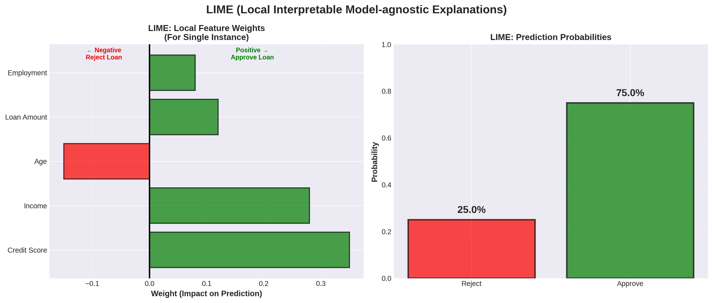

# Lesson 3: LIME 🍋

**Module 9: Explainable AI | Lesson 3 of 4**

Master LIME - Local Interpretable Model-agnostic Explanations!

---


## Visual Guides 📊


*LIME local explanation*

---

## What is LIME?

**Explains individual predictions by approximating with simple model:**
- Works for any model
- Local explanations
- Interpretable
- Fast

---

## 1. Installation & Setup 🔧

```bash
pip install lime
```

```python
import lime
import lime.lime_tabular
from sklearn.ensemble import RandomForestClassifier
from sklearn.datasets import load_breast_cancer
import numpy as np

# Load data
data = load_breast_cancer()
X_train, X_test = data.data[:400], data.data[400:]
y_train, y_test = data.target[:400], data.target[400:]

# Train
rf = RandomForestClassifier(n_estimators=100, random_state=42)
rf.fit(X_train, y_train)
```

---

## 2. Tabular Explainer 📊

```python
# Create explainer
explainer = lime.lime_tabular.LimeTabularExplainer(
    X_train,
    feature_names=data.feature_names,
    class_names=['malignant', 'benign'],
    mode='classification'
)

# Explain a prediction
i = 0  # First test sample

exp = explainer.explain_instance(
    X_test[i],
    rf.predict_proba,
    num_features=10
)

# Show explanation
exp.show_in_notebook(show_table=True)

# Or as text
print(exp.as_list())

# Plot
exp.as_pyplot_figure()
```

---

## 3. Understanding LIME Output 📈

```python
# Get explanation as list
explanation = exp.as_list()

print("Feature contributions:")
for feature, weight in explanation:
    print(f"{feature}: {weight:.3f}")

# Get prediction probabilities
print(f"\nPrediction probabilities: {exp.predict_proba}")

# Get local prediction
print(f"Local prediction: {exp.local_pred}")

# Feature values for this instance
print(f"\nFeature values:")
for i, feature in enumerate(data.feature_names[:10]):
    print(f"{feature}: {X_test[0, i]:.2f}")
```

---

## 4. Multiple Predictions 🔄

```python
# Explain multiple samples
n_samples = 5

for i in range(n_samples):
    exp = explainer.explain_instance(
        X_test[i],
        rf.predict_proba,
        num_features=5
    )

    print(f"\n=== Sample {i} ===")
    print(f"True label: {data.target_names[y_test[i]]}")
    print(f"Predicted: {data.target_names[rf.predict([X_test[i]])[0]]}")
    print(f"Top features:")

    for feature, weight in exp.as_list()[:5]:
        print(f"  {feature}: {weight:.3f}")
```

---

## 5. Text Classification 📝

```python
from lime.lime_text import LimeTextExplainer
from sklearn.feature_extraction.text import TfidfVectorizer
from sklearn.naive_bayes import MultinomialNB

# Example text data
texts = [
    "This movie was amazing! I loved it!",
    "Terrible film, waste of time",
    "Great acting and plot",
    "Boring and predictable",
    "Best movie I've seen this year!"
]
labels = [1, 0, 1, 0, 1]  # 1=positive, 0=negative

# Train
vectorizer = TfidfVectorizer()
X_train = vectorizer.fit_transform(texts)

clf = MultinomialNB()
clf.fit(X_train, labels)

# LIME text explainer
text_explainer = LimeTextExplainer(class_names=['negative', 'positive'])

# Explain
text = "This movie was fantastic and entertaining!"

exp = text_explainer.explain_instance(
    text,
    lambda x: clf.predict_proba(vectorizer.transform(x)),
    num_features=6
)

# Show
exp.show_in_notebook(text=text)

# Print
print("Explanation:")
print(exp.as_list())
```

---

## 6. Image Classification 🖼️

```python
from lime import lime_image
from skimage.segmentation import mark_boundaries
import matplotlib.pyplot as plt

# Assume we have an image classifier
# image shape: (height, width, channels)

def predict_fn(images):
    """Wrapper for model prediction"""
    # Process images and return predictions
    return model.predict_proba(images)

# Create explainer
image_explainer = lime_image.LimeImageExplainer()

# Explain image
explanation = image_explainer.explain_instance(
    image,
    predict_fn,
    top_labels=5,
    hide_color=0,
    num_samples=1000
)

# Get top predicted label
top_label = explanation.top_labels[0]

# Get image and mask
temp, mask = explanation.get_image_and_mask(
    top_label,
    positive_only=True,
    num_features=5,
    hide_rest=False
)

# Plot
plt.imshow(mark_boundaries(temp / 2 + 0.5, mask))
plt.title(f'Positive regions for label {top_label}')
plt.show()
```

---

## 7. Comparing LIME vs SHAP 🥊

```python
import shap

# Example: Same sample with both methods

# LIME
lime_exp = explainer.explain_instance(
    X_test[0],
    rf.predict_proba,
    num_features=10
)

lime_values = dict(lime_exp.as_list())

# SHAP
shap_explainer = shap.TreeExplainer(rf)
shap_values = shap_explainer.shap_values(X_test[0].reshape(1, -1))[1][0]

# Compare
comparison_df = pd.DataFrame({
    'feature': data.feature_names,
    'lime_importance': [lime_values.get(f, 0) for f in data.feature_names],
    'shap_value': shap_values
}).sort_values('shap_value', key=abs, ascending=False)

print(comparison_df.head(10))

# Plot comparison
fig, axes = plt.subplots(1, 2, figsize=(15, 6))

# LIME
axes[0].barh(comparison_df['feature'][:10],
            comparison_df['lime_importance'][:10])
axes[0].set_title('LIME Importances')
axes[0].invert_yaxis()

# SHAP
axes[1].barh(comparison_df['feature'][:10],
            comparison_df['shap_value'][:10])
axes[1].set_title('SHAP Values')
axes[1].invert_yaxis()

plt.tight_layout()
plt.show()
```

---

## Quick Reference 📖

**LIME Template:**

```python
from lime.lime_tabular import LimeTabularExplainer

# Create explainer
explainer = LimeTabularExplainer(
    X_train,
    feature_names=feature_names,
    class_names=class_names,
    mode='classification'  # or 'regression'
)

# Explain instance
exp = explainer.explain_instance(
    instance,
    model.predict_proba,
    num_features=10
)

# Visualize
exp.show_in_notebook()
exp.as_pyplot_figure()
```

**LIME vs SHAP:**

| Aspect | LIME | SHAP |
|--------|------|------|
| Speed | Fast | Slower (KernelExplainer) |
| Theory | Local approximation | Game theory |
| Consistency | Not always | Yes |
| Global | No | Yes |
| Local | Yes | Yes |
| Best for | Quick explanations | Thorough analysis |

---

## Key Takeaways 💡

1. **LIME** = local linear approximation
2. **Model-agnostic** (works for any model)
3. **Fast** and intuitive
4. **Great for text/images**
5. **Less consistent** than SHAP
6. **Good for quick** explanations
7. **Use both** LIME and SHAP for validation

---

**Next:** [Lesson 4 - Model Interpretation Best Practices →](Lesson%204%20-%20Model%20Interpretation%20Best%20Practices.md)
